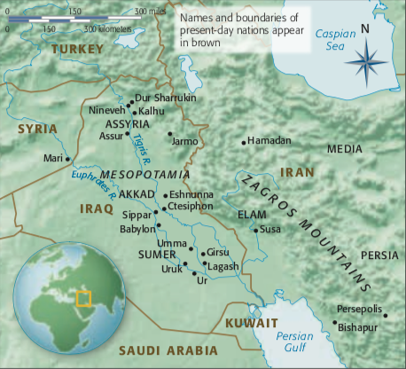

# Ancient Mesopotamia and Persia

Mesopotamia, greek name for "the land between rivers \(Tigris and Euphrates\)", is where the funadamental change in the nature of our daily lives first occurred. Often called the Fertile Crescent, Mesopotamia is the presumed locale of the biblical Garden of Eden \(Gen. 2.10–15\).

## Sumer

3500-2332 BCE

Ancient Sumer, which roughly corresponds to southern Iraq today, comprised a dozen or so independent city-states under the protection of different Mesopotamian deities.

Two great inventions of Sumerians are city-state, which are ruled by a single person or a council, and writing, from early pictographs to later more abstract cuneiform signs. The Sumerians also produced great literature. Their most famous work, known from fragmentary cuneiform texts, is the late-third-millennium bce Epic of Gilgamesh, which antedates the Greek poet Homer’s Iliad and Odyssey by some 1,500 years. It recounts the heroic story of Gilgamesh, legendary king of Uruk and slayer of the monster Huwawa.

#### **White Temple and its ziggurat** 

A ziggurat is a built raised platform with four sloping sides—like a chopped-off pyramid. Ziggurats are made of mud-bricks—the building material of choice in the Near East, as stone is rare.

Lots of attention are drawn due to the great discovery of the Royal Cemetery at Ur in southern Iraq, by British archaeologist Sir Leonard Woolley \(1880–1960\) in the 1920s.

#### **Mask of Wakar**

Marble is rare in Uruk so the stone for this might come at a great cost. There should be a lot of decoration in its original appearance, like a wig at the top of the head and colored shell or stone filling the eyebrows and eyes.

#### Warka Vase

The Sumerians were probably the first to use pictures to tell coherent stories. This vase depicts a religious ceremony.

#### Eshnunna Statuettes

The inlaid oversized eyes and the tiny hands, which represents a conscious decision on the part of the sculptors to vary the size of the parts of the body—a kind of hierarchy of scale within a single figure complementing the hierarchy of scale among figures in a group. Perhaps the purpose of these votive figures was to offer constant prayers to the gods on their donors’ behalf, the open-eyed stares most likely symbolize the eternal wakeful- ness necessary to fulfill their duty.

Similar figurines are found at other sites. I hate to admit it but these are my favorites. Aren't they both creepy and cute...

#### Standard of Ur

Two principal roles of a Sumerian ruler—the mighty warrior who defeats enemies of his city-state, and the chief administrator who, with the blessing of the gods, assures the bountifulness of the land in peacetime. Isn't it beautiful.

#### Mesopotamian Seals

## Akkad

2332-2150 BCE

Sumer cities got dominated by a great ruler, Sargon of Akkad \(r. 2332–2279 BCE\). The Akkadians were Semitic in origin.

## Neo-Sumerian and Babylonian

2150-1600 BCE

## Hittite and Assyrian

1600-612 BCE

## Neo-Babylonian and Achaeminid

604-559 BCE

## Greco-Roman and Sasanian

330 BCE -636 CE

Image Credits

* [Khan Academy](https://www.khanacademy.org/)
* [https://17green.wordpress.com/](https://17green.wordpress.com/)
* [@rabihalameddine](https://twitter.com/rabihalameddine)

