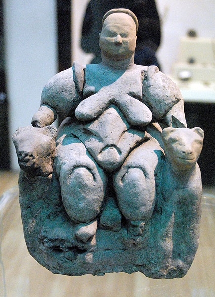

# Art in the Stone Age

#### **Makapansgat pebble**

Though it is not manufactured but naturely formed, it is the earliest evidence of human recognition of pictorial image if not art.

People usually divide Stone Age into 3 periods by the development of stone implements. Another division is based on food source, from gathering to production.

## Paleolithic

40,000 - 9000 BCE

### Africa

#### Apollo 11 Cave

More yet to be found.

### Europe

#### Lion-man

One of the oldest sculptures ever discovered.

Experts estimate this ivory figure required about 400 hours \(two months\) of skilled work. 

#### **Venus of Willendorf**

Also important in Paleolithic art is the over 200 sites of painted caves. Some of the most famouts caves:

#### **Pech-Merle Cave**

Negtive hand prints: 

#### **Lascaux Cave**

Most animals in Paleolithic are painted in strict profile view. But the bulls from Lascaux cave ****are using composite view: horns from the front so both horns are shown, rest of the body in profile.

First appearance of man \(as opposed to woman\) in the history of art. Bird-faced, bird staff \(?\), four fingers and one prominent penis:

Check out the cool guide tour: [https://archeologie.culture.fr/lascaux/en](https://archeologie.culture.fr/lascaux/en).

#### **Chauvet Cave**

MIght be the oldest cave found. Also it has the most advanced art style.

## Meolithic and Neolithic

9000 BCE - 8000 BCE are a transition period from Paleolithic to Neolithic, called Meolithic. Around 9000 BCE climate warmed. The sea level rose more than 300 feet, separating England from continental Europe, and Spain from Africa. The reindeer migrated north, and the woolly mammoth disappeared. Food gathering intensified and dogs are tamed.

Then it's 8000 BCE - 2300 BCE the Neolithic period. Agriculture and livestock became humankind’s major food sources.

### Anatolia and Mesopotamia

The oldest known settled communities are here.

#### **Göbekli Tepe**

The oldest temple discovered.

Many of these T-shaped pillars:

Some famous settlements:

* **Neolithic Jericho**, ca. 8000-7000 BCE.
* **Ain Ghazal,** ca. 7200-5000 BCE.
* **Çatal Höyük**, ca. 6000-5900 BCE.

At Ain Ghazal, three dozen of these plaster statuettes and busts are found:

At Çatal Höyük, many of these interesting figurines are found:

Also the wall paintings here are very different from Paleolithic paintings. Human figure appears much more:  

First landscape painting:

### Europe

No town of similar scale discovered. But many megalithic \(great stones\) architectures exist:

* **Newgrange tomb**, Newgrange, Ireland, ca. 3200-2500 BCE.
* **Skara Brae village**, Skara Brae, Orkney Islands, UK, ca. 3100-2500 BCE.
* **Hagar Qim temple**, Malta, ca.3200-2500 BCE
* **Stonehenge**, Salisbury Plain, Wiltshire, England, UK, ca.2550-1600 BCE.

Both at Hagar Qim and Stonehenge, lots of post-and-lintel styles are used. 3 stones, 2 vertical posts and 1 horizonal lintel, formed an arch.

Image Credits:

* [Wikipedia](https://www.wikipedia.org/)
* [Don Hitchcock](https://www.donsmaps.com/)
* [SmartHistory](https://smarthistory.org) \(Fantastic site for a systematic art history education\)
* [UNESCO World Heritage Convention](https://whc.unesco.org/)
* [http://users.stlcc.edu/mfuller/catalhuyuk.html](http://users.stlcc.edu/mfuller/catalhuyuk.html)
* [http://www.sci-news.com/archaeology/science-catalhoyuk-map-mural-volcanic-eruption-01681.html](http://www.sci-news.com/archaeology/science-catalhoyuk-map-mural-volcanic-eruption-01681.html)

