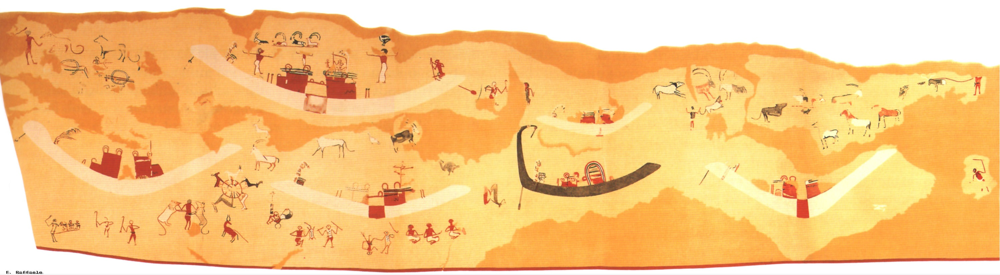
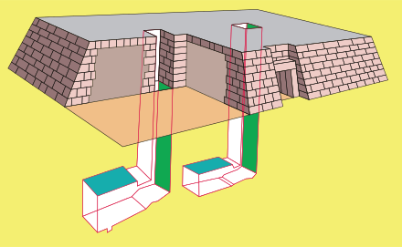

# Egypt from Narmer to Cleopatra

## Predynastic and Early Dynastic \(3500 - 2575 BCE\)

Egypt in predynastic periood was divided into Upper Egypt and Southern Egypt. Note that the upper means Niles upstream so it is the southern part in a modern map.

Above is an interesting mural painting from Upper Egypt. Below it's the Palette of King Narmer. This is one of the earliest historical \(versus prehistorical\) artworks according to the book. The palette is used to prepare eye makeup which Egyptians used to protect their eyes against sun glare. It probably depicts unification of two kingdoms but in reality this unification might not be a single event.

The tomb type popular at predynastic times is mastaba \(Arabic, "bench"\). It is flat roofed as opposed to the classical pyramids shape later.

However there are some tombs resembles later pyramids:

Saqqara was the ancient necropolis \(Greek for "city of the dead"\) of Memphis. Memphis was Egypt's capital at that time.

## Old Kingdom \(2575 - 2134 BCE\)

Begin from Sneferu \(r. 2575 - 2551 BCE\), first king of the Fourth Dynasty to the breakup of the Eighth Dynasty around 2134 BCE.

## Middle Kingdom \(2040 - 1640 BCE\)

## New Kingdom \(1550 - 1070 BCE\)

## First Millennium \(1000 BCE - 30 CE\)

